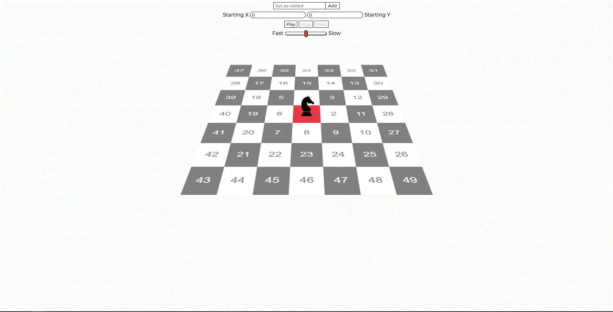
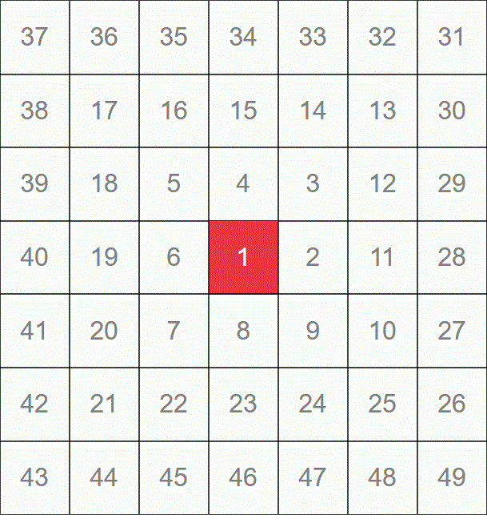

<h1 align="center"> The Trapped Knight </h1>
<p align="center"> Inspired by <a href="https://www.youtube.com/watch?v=RGQe8waGJ4w"> Numberphile</a> </p><br>

<hr>
<h2 align="center">Introduction</h2><br>
<p> The Trapped Knight is a chess-based problem invented by the mathematician Neil Sloane, and firstly mentioned in <a href="https://oeis.org/A316667"> The On-Line Encyclopedia of Integer Sequences</a>. The chess board consists of a square spiral of numbers, starting with a finite number (1) and continuing to infinity, as you can see the following picture:<br><br>
<p align="center"></p><br>
In this board, the knight starts in the initial square* and moves according to the rules of chess. In addition, this knight can only move to the square containing the smallest number, and it can never return to that specific square. So the first move is to square 10, the second to square 3, and so on.<br><br>
*you will be able to change this setting via the Starting X and Starting Y controls in my visualization.
<br><br><br>
<h2 align="center"> What is the problem? </h2><br>
<p>The problem is that, eventually, the knight is going to get trapped, having no other legal move to make. In the "vanilla" setting this happens after 2016 steps, as you can see from this graph generated by my application:<br><br>
<br><br>
It’s important to realise that, as the Medium writer Maarten Mortier already pointed out, that the way this grid is built is ultimately what leads to the strange <a src="https://en.wikipedia.org/wiki/Collatz_conjecture">Collatz-sequence</a> like nature. In addition, as I already mentioned, in order to make the problem even more interesting I have taken the liberty of bending the rules slightly and adding other interactive features.
</p>
<br><br>
<h2 align="center"> What are these features? </h2><br>
<p>What would happen if the knight started in a square that is not (0,0)? That's exactly what I asked myself, and to answer this dilemma I added the possibility of starting from a different point on the map, by adding a custom X and Y in the appropriate inputs.<br><br>Then, inspired by a comment under Numberphile's video, I also added the possibility of marking squares as already visited from the beginning, leading to a significant change in the knight's path.<br><br>The result of these operations can be seen (along with other statistics) by clicking on the "Stats" button, which will light up once the knight has stopped. Here you will be able to see an interactive graph, and every single option you changed before the animation started.
</p><hr>
<h2 align="center"> The code basis </h2><br>
<p>The table is dynamically generated using the following algorithm:</p>

```javascript
// Diagonal, horizontal, and vertical lines in the number spiral correspond to
// polynomials of the form f(n) = 4n^2 + bn + c

const spiralCell = (x, y) => {
    if (x == y & y == 0) return 1;
    else if (-x < y && y <= x) { // This means that we are in the first quadrant
        let n = Math.abs(x);
        return (4 * Math.pow(n, 2)) - (2 * n) + 1 + y - n;
    } else if (-y <= x && x < y) { // This means that we are in the second quadrant
        let n = Math.abs(y);
        return (4 * Math.pow(n, 2)) + 1 - n - x;
    } else if (x <= y && y < -x) { // This means that we are in the third quadrant
        let n = Math.abs(x);
        return (4 * Math.pow(n, 2)) + n + 1 - y;
    } else if (y < x && x <= -y) { // This means that we are in the fourth quadrant
        let n = Math.abs(y);
        return (4 * Math.pow(n, 2)) + (3 * n) + 1 + x;
    }
};
```
<p> This algorithm is based on 4 quadrants (+,+; -,+; -,-; +,-), and using the equations f(n) = 4n^2 + bn + c, described in details <a href="https://en.wikipedia.org/wiki/Ulam_spiral#Explanation"> in this Wikipedia page</a>. This function returns the value of the cell at (x,y). Using this information, we can easily generate the values to insert in our 7x7 table:</p>

```javascript
const createTable = (x, y, size) => { // size is equal to the number of rows in each direction

    let divNumber = 1; // first div in DOM
    for (let i = size; i >= -size; i--) { // iterate the bidimensional array from +n to -n
        let rowNumber = 1; // first div in .column
        for (let j = -size; j <= size; j++) { // iterate each array object from +n to -n
            // get the item based on querySelector
            currentRow = `#perspective > div:nth-child(${divNumber}) > div:nth-child(${rowNumber})`;
            // set the current row to the correct value
            document.querySelector(currentRow).innerHTML = spiralCell(x + j, y + i); 
            rowNumber++;
        }
        divNumber++;
    }
};
```
<p>As you can see, this function takes three argument: x,y and size. The first two are the coordinates of the central square, while size is the number of rows expanding from the center (in my application it will always be three). Once we generated our cell, it's time to trap the knight. To do that, we first have to find an algorithm to tell the knight what his next move is going to be. My implementation is the following:</p>

```javascript
    // get the smallest number in relativeMoves not included in visited
    for (let i = 0; i < knightMoves; i++) { 

        // smallestValue before the visited check
        smallestValue = Math.min.apply(Math, relativeMoves.map(function (o) { return o.value; })); 
        if (visited.includes(smallestValue)) {
            // index of smallestValue before the visited check
            indexOfVisited = relativeMoves.findIndex(el => el.value === smallestValue); 
            relativeMoves.splice(indexOfVisited, 1);
        } else {
            break;
        }
    }

    visited.push(smallestValue); // add this value to the visited ones
```

<p> In this code snippet, there here are a few new elements that needs a bit of attention. The first one is knightMoves, and it's a simple const int variable containing the number 8, which is the number of total moves a knight can do in chess. The second one is relativeMoves, and it's an object that stores the X and Y of every possible move made by our knight:</p>

```javascript
{
        x: currentX - 1, // currentX is the X where the knight is located
        y: currentY - 2, // currentY is the X where the knight is located
        get value() { return spiralCell(this.x, this.y); } // return the value contained inside the cell
    }
```
<p>the variable smallestValue is declared outside of this function scope, but it's defined here, and it contains the smallest value stored in relativeMoves. The last unknown item is visited, and it's the array containing every cell we've already visited.<br><br>At this point everything else is quite expressive, and the function that contains this loop will return the next move object. But what if there's no next move? In that case, the function is going to return the string "trap", and the stats relative to the customized problem will be generated.</p><br>

<hp align="center">Obviously, the code written above is just a small part of everything that is done, but it is necessary to understand the basis on which this application operates. If you have any questions about any part of the code, feel free to contact me in any way, and I will be more than happy to answer them!</hp><br>
<hr><br>
<h2 align="center"> Project Setup </h2><br>
<p align="center"> In order to make the application accessible to everyone, it is already hosted on my <a href="https://trappedknight.claudiocastorina.com">website</a>. If you want to modify it or contribute to it in any way (btw, every pull request is appreciated!) you can simply clone it and do whatever you want with it, since it's made in vanilla Javascript only and does not require external libraries.</p><br>
<h2 align="center"> Credits </h2><br>
<p align="center"><a href="https://github.com/chartjs/Chart.js"> Chart.js (MIT)</a><br>
<a href="https://github.com/chartjs/chartjs-plugin-zoom"> chartjs-plugin-zoom (MIT)</a></p><br>
<h2 align="center"> License </h2><br>

<p align="center">
<a href="https://choosealicense.com/licenses/mit/"> MIT</a>
</p>
